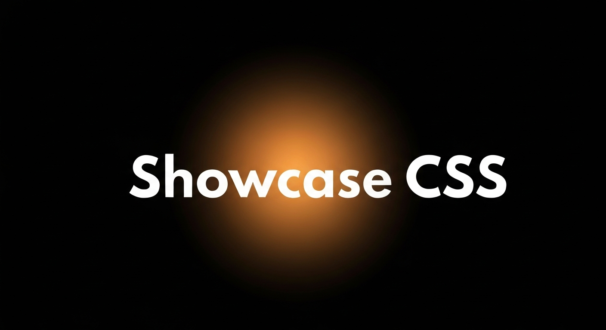

<p align="center">
  
</p>

# showcase-css

Lightweight CSS spotlight effect that follows the mouse cursor. Zero dependencies — pure vanilla JS + CSS custom properties.

## Install

```bash
npm install github:ysnotksk/showcase-css
```

## Quick Start

```js
import showcase from 'showcase-css';

// Apply spotlight to document.body with defaults
const spot = showcase();

// Later, remove the effect
spot.destroy();
```

## Usage

```js
// With a specific element and options
const spot = showcase(document.querySelector('.hero'), {
  color: 'rgba(99, 102, 241, 0.2)',
  radius: '400px',
  intensity: 0.8,
  bg: '#0f0f23',
  smoothing: 0.1,
});

// Update options on the fly (no re-initialization)
spot.setOptions({ color: 'rgba(52, 211, 153, 0.25)', bg: '#0f1f1a' });

// Options-only (applies to document.body)
const spot2 = showcase({
  color: 'rgba(52, 211, 153, 0.25)',
  radius: '250px',
});
```

## Options

| Option | Type | Default | Description |
|---|---|---|---|
| `color` | `string` | `rgba(255,255,255,0.15)` | Spotlight color |
| `radius` | `string` | `300px` | Radius of the gradient |
| `intensity` | `number` | `1` | Opacity multiplier (0–1) |
| `bg` | `string` | `#1a1a2e` | Base background color |
| `smoothing` | `number` | `0.15` | Easing factor (0 = max lag, 1 = instant) |

All options map to CSS custom properties (`--spotlight-color`, `--spotlight-radius`, etc.) and can also be overridden directly in CSS:

```css
.hero {
  --spotlight-color: rgba(99, 102, 241, 0.2);
  --spotlight-radius: 400px;
}
```

## API

### `showcase(target?, options?) → Controller`

| Parameter | Type | Default | Description |
|---|---|---|---|
| `target` | `HTMLElement` | `document.body` | Element to attach the effect to |
| `options` | `object` | `{}` | See Options above |

### Controller

| Method | Description |
|---|---|
| `destroy()` | Remove the effect and all event listeners |
| `setOptions(opts)` | Update options without re-initialization |

## Behavior Notes

- **Touch devices**: The effect is automatically disabled on touch-primary devices (`hover: none` media query). The controller methods still exist but are no-ops, so your code won't break.
- **SSR**: Safe to import in server-side environments (Node.js, Deno, etc.). Returns a no-op controller when `window` is unavailable.

## How It Works

1. Sets CSS custom properties as inline styles on the target element
2. Adds a `data-spotlight` attribute to the target
3. Listens for `mousemove` events with `requestAnimationFrame` smoothing
4. Updates `--spotlight-x` and `--spotlight-y` on each frame
5. A `radial-gradient()` in the inline `background` reacts to those variables in real time

## Browser Support

Requires CSS custom properties and ES modules — all modern browsers (Chrome, Firefox, Safari, Edge). No IE11.

## Demo

**[Live Demo](https://ysnotksk.github.io/showcase-css/demo/)**

Or run locally:

```bash
make demo
# Opens http://localhost:8000/demo/
```

## License

MIT
